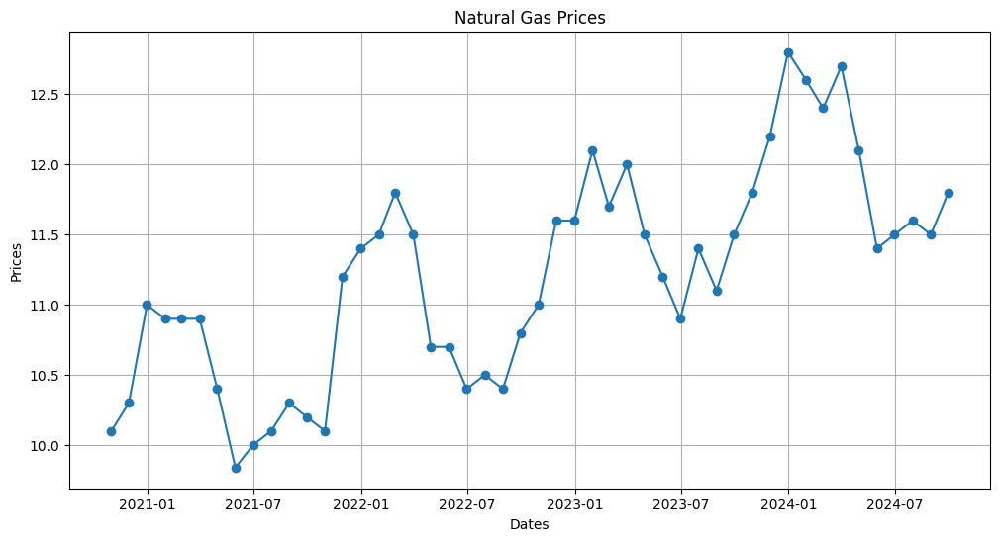
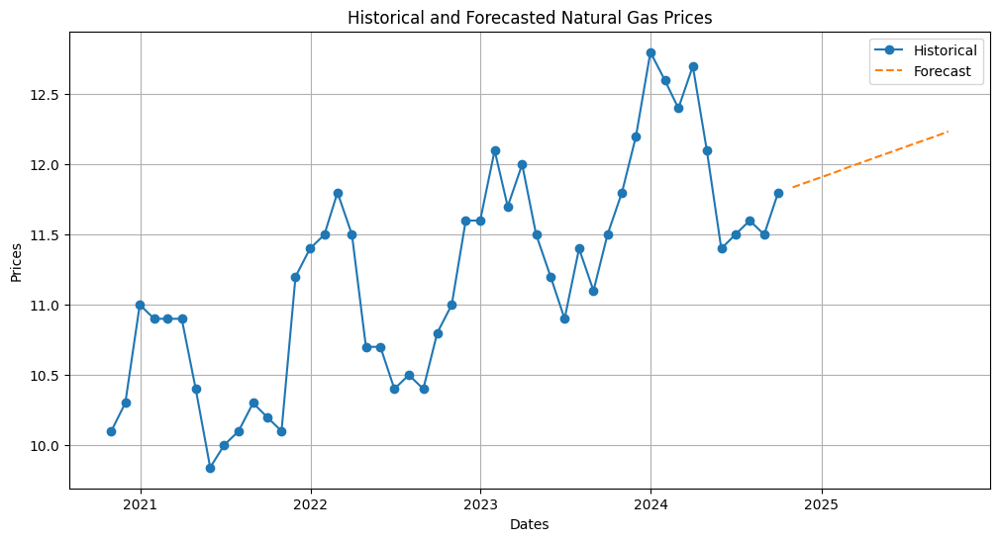

# Natural Gas Price Forecasting and Estimation

## Overview

This project analyzes historical natural gas prices and develops a model to estimate gas prices for any given date. Using monthly natural gas price data from October 2020 to September 2024, the project performs data visualization, interpolation, and forecasting to provide price estimates for both historical and future dates.

## Objectives

- Analyze historical natural gas price trends.
- Visualize price movements and seasonal patterns.
- Estimate prices for dates between known observations.
- Forecast natural gas prices for one additional year.
- Create a reusable function that returns a price estimate for any specified date.

## Tools and Libraries

- Python
- Pandas
- NumPy
- Matplotlib
- SciPy

## Dataset

The dataset contains monthly natural gas prices with the following columns:

- **Dates** – End-of-month observation dates
- **Prices** – Natural gas purchase prices

Data Period:
- October 2020 – September 2024

## Methodology

1. Imported and cleaned the dataset using Pandas.
2. Converted date values into datetime format.
3. Visualized historical price trends using Matplotlib.
4. Applied linear interpolation to estimate prices between recorded dates.
5. Extended the dataset through extrapolation to forecast prices for one additional year.
6. Developed a function that accepts a date and returns an estimated natural gas price.

## Key Features

- Historical price analysis
- Trend visualization
- Price interpolation
- Future price forecasting
- Date-based price estimation function

## Example

estimate_price('2023-06-15')

## Project Structure
JPMORGAN PROJECT/
•	Nat_Gas.csv
•	natural_gas.ipynb
•	requirements.txt

## Visualizations

## Author
Barnice Malingu

Aspiring Data Analyst | Python | SQL | Data Visualization | Business Intelligence
